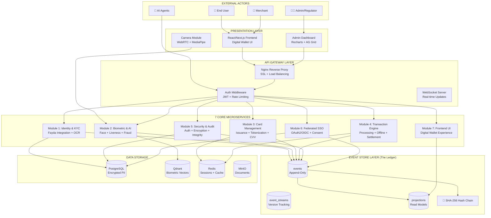
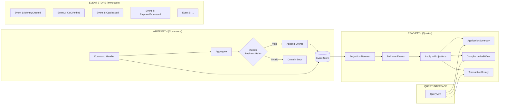
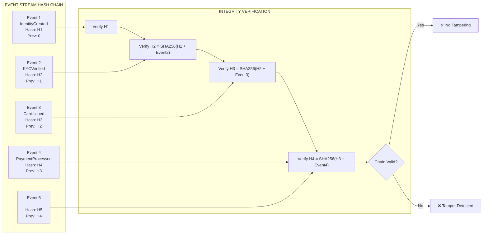
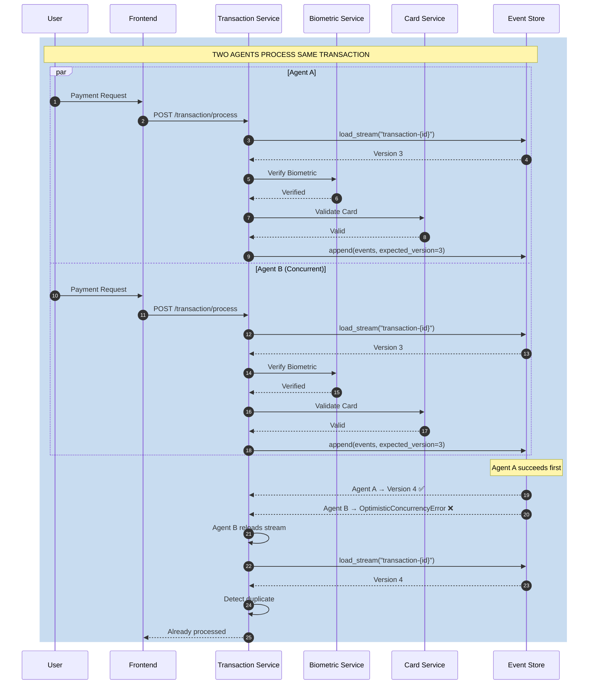
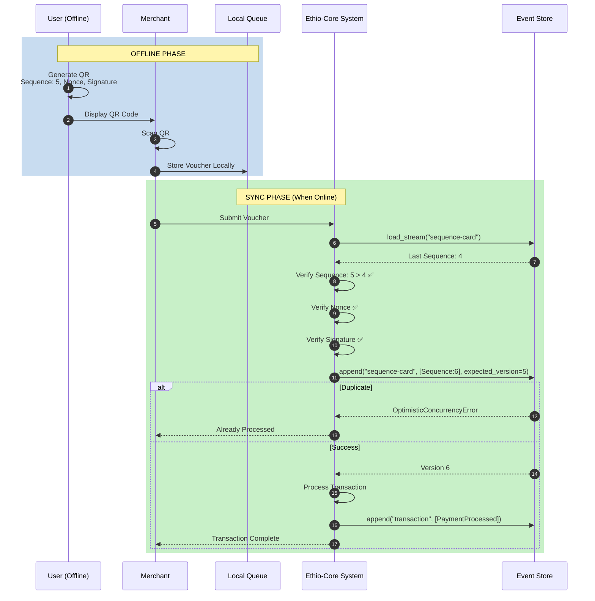
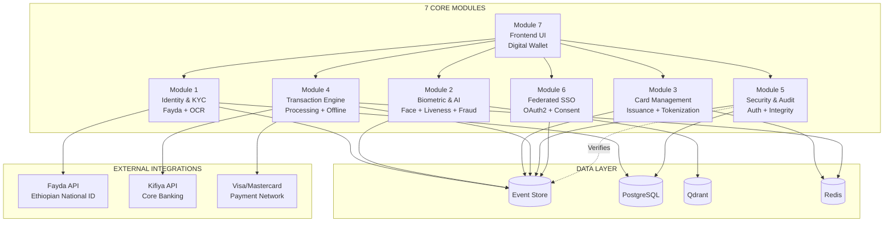
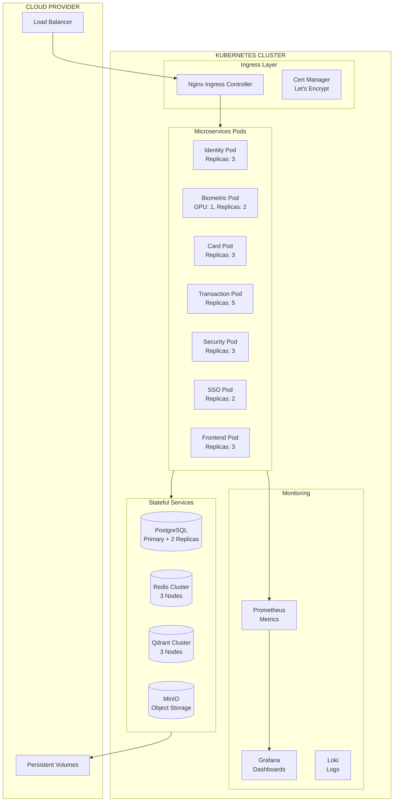
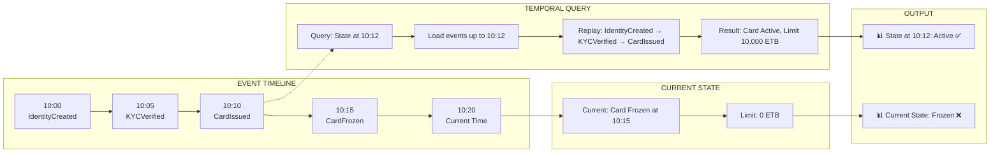
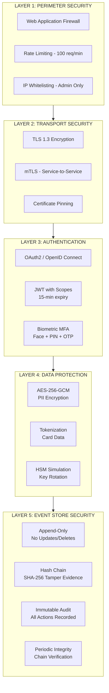

# Ethio-Core: Ethiopia's First Event-Sourced Financial Infrastructure

[](https://github.com/ethio-core/ethio-core/actions/workflows/ci.yml)
[](https://opensource.org/licenses/MIT)
[](https://www.python.org/downloads/)
[](https://www.docker.com/)
[](https://kubernetes.io/)
[](https://martinfowler.com/eaaDev/EventSourcing.html)

## 🚀 Overview

**Ethio-Core** is a comprehensive, production-ready financial infrastructure platform built for the **Kifiya Inspire 3.0 Hackathon**. It combines all five core challenge areas into a unified, event-sourced system:

| Challenge Area | Implementation |
|----------------|----------------|
| **A. AI-Driven Biometric Verification** | Face recognition, liveness detection, deepfake detection, voice biometrics, fairness metrics |
| **B. Intelligent eKYC Orchestration** | Fayda National ID integration, OCR+NLP, synthetic identity detection, KYC portability |
| **C. Digital Identity System** | Identity lifecycle, selective disclosure, secure vault, identity recovery |
| **D. Federated SSO** | OAuth2/OIDC, consent management, cross-border federation, biometric-backed SSO |
| **E. Card-Based Identity & Transaction** | Virtual cards, biometric binding, offline payments, dynamic CVV, tokenization |

## 🏆 Key features

- **Immutable Event Store**: Every action is recorded as an append-only event — complete audit trail
- **Cryptographic Hash Chain**: SHA-256 tamper-evident security — bank-grade integrity
- **Temporal Queries**: "Time-travel" audit capability — ask "what was the state at 2:00 PM?"
- **Gas Town Pattern**: Agent memory survives crashes — zero data loss
- **Optimistic Concurrency**: Prevents double-spending — handles race conditions
- **Fayda Integration**: Native Ethiopian National ID support — local relevance
- **Offline Payments**: Sequence-protected QR vouchers — financial inclusion
# ETHIO-CORE - COMPLETE SYSTEM ARCHITECTURE DIAGRAMS
## DIAGRAM 1: HIGH-LEVEL SYSTEM ARCHITECTURE

# DIAGRAM 2: EVENT SOURCING ARCHITECTURE

# DIAGRAM 3: CRYPTOGRAPHIC HASH CHAIN

# DIAGRAM 4: TRANSACTION FLOW WITH OPTIMISTIC CONCURRENCY

# DIAGRAM 5: OFFLINE PAYMENT FLOW

# DIAGRAM 6: MODULE INTERACTION MAP

# DIAGRAM 7: DEPLOYMENT ARCHITECTURE (KUBERNETES)

# DIAGRAM 8: TEMPORAL QUERY (TIME-TRAVEL AUDIT)

# DIAGRAM 9: SECURITY ARCHITECTURE LAYERS

# DIAGRAM 10: COMPLETE USER JOURNEY

```mermaid
flowchart TD
    START([Start]) --> STEP1

    subgraph STEP1[STEP 1: REGISTRATION - 2 minutes]
        A1[User enters phone number]
        A2[OTP verification]
        A3[IdentityCreated event]
        A4[Fayda ID linked]
    end

    STEP1 --> STEP2

    subgraph STEP2[STEP 2: BIOMETRIC ENROLLMENT - 1 minute]
        B1[User positions face in camera]
        B2[Liveness detection - blink + motion]
        B3[Face embedding extracted]
        B4[BiometricEnrolled event]
    end

    STEP2 --> STEP3

    subgraph STEP3[STEP 3: KYC VERIFICATION - 2 minutes]
        C1[User uploads Fayda ID]
        C2[OCR extracts data]
        C3[NLP verifies consistency]
        C4[KYCVerified event]
    end

    STEP3 --> STEP4

    subgraph STEP4[STEP 4: CARD ISSUANCE - 30 seconds]
        D1[User requests virtual card]
        D2[Biometric verification]
        D3[CardIssued event]
        D4[Dynamic CVV generated]
    end

    STEP4 --> STEP5

    subgraph STEP5[STEP 5: PAYMENT - 15 seconds]
        E1[User enters amount + merchant]
        E2[Biometric verification]
        E3[Risk scoring - fraud check]
        E4[PaymentProcessed event]
        E5[IntegrityCheckRun event]
    end

    STEP5 --> END([Complete])

    style STEP1 fill:#e1f5fe
    style STEP2 fill:#e8f5e9
    style STEP3 fill:#fff3e0
    style STEP4 fill:#fce4ec
    style STEP5 fill:#f3e5f5
```

## 📁 Repository Structure

```bash
ethio-core/
│
├── README.md                           # Main documentation
├── LICENSE                             # MIT License
├── docker-compose.yml                  # Local development setup
├── docker-compose.prod.yml             # Production setup
├── .env.example                        # Environment variables template
├── .gitignore                          # Python/Node/IDE ignores
├── Makefile                            # Common commands
│
├── docs/                               # Documentation
│   ├── ARCHITECTURE.md                 # System architecture
│   ├── API_REFERENCE.md                # Complete API docs
│   ├── DATABASE_SCHEMA.md              # PostgreSQL schema
│   ├── DEPLOYMENT.md                   # Deployment guide
│   ├── EVENT_CATALOGUE.md              # All event types
│   └── USER_GUIDE.md                   # End-user documentation
│
├── modules/                            # 7 Core Modules
│   │
│   ├── m1-identity/                    # Module 1: Identity & KYC
│   │   ├── Dockerfile
│   │   ├── requirements.txt
│   │   ├── pyproject.toml
│   │   ├── README.md
│   │   ├── src/
│   │   │   ├── __init__.py
│   │   │   ├── main.py
│   │   │   ├── models.py
│   │   │   ├── event_handlers.py
│   │   │   ├── ocr_engine.py
│   │   │   ├── fayda_integration.py
│   │   │   └── kyc_orchestrator.py
│   │   └── tests/
│   │       ├── test_identity.py
│   │       ├── test_kyc.py
│   │       └── test_fayda.py
│   │
│   ├── m2-biometric/                   # Module 2: Biometric & AI
│   │   ├── Dockerfile
│   │   ├── requirements.txt
│   │   ├── src/
│   │   │   ├── main.py
│   │   │   ├── face_recognition.py
│   │   │   ├── liveness_detection.py
│   │   │   ├── fraud_detection.py
│   │   │   └── fairness_metrics.py
│   │   └── tests/
│   │
│   ├── m3-card/                        # Module 3: Card Management
│   │   ├── Dockerfile
│   │   ├── requirements.txt
│   │   ├── src/
│   │   │   ├── main.py
│   │   │   ├── card_issuance.py
│   │   │   ├── tokenization.py
│   │   │   └── dynamic_cvv.py
│   │   └── tests/
│   │
│   ├── m4-transaction/                 # Module 4: Transaction Engine
│   │   ├── Dockerfile
│   │   ├── requirements.txt
│   │   ├── src/
│   │   │   ├── main.py
│   │   │   ├── transaction_processor.py
│   │   │   ├── offline_queue.py
│   │   │   └── settlement.py
│   │   └── tests/
│   │
│   ├── m5-security/                    # Module 5: Security & Audit
│   │   ├── Dockerfile
│   │   ├── requirements.txt
│   │   ├── src/
│   │   │   ├── main.py
│   │   │   ├── auth_service.py
│   │   │   ├── audit_chain.py
│   │   │   └── integrity_checker.py
│   │   └── tests/
│   │
│   ├── m6-sso/                         # Module 6: Federated SSO
│   │   ├── Dockerfile
│   │   ├── requirements.txt
│   │   ├── src/
│   │   │   ├── main.py
│   │   │   ├── oauth2_provider.py
│   │   │   └── consent_manager.py
│   │   └── tests/
│   │
│   └── m7-frontend/                    # Module 7: Digital Wallet
│       ├── Dockerfile
│       ├── package.json
│       ├── next.config.js
│       ├── tailwind.config.js
│       ├── src/
│       │   ├── pages/
│       │   ├── components/
│       │   ├── hooks/
│       │   └── services/
│       └── tests/
│
├── event-store/                        # Event Store Infrastructure
│   ├── schema.sql                      # PostgreSQL schema
│   ├── migrations/                     # Alembic migrations
│   │   ├── versions/
│   │   └── alembic.ini
│   └── projections/                    # Read model projections
│       ├── application_summary.py
│       ├── compliance_audit.py
│       └── agent_performance.py
│
├── k8s/                                # Kubernetes manifests
│   ├── namespace.yaml
│   ├── configmap.yaml
│   ├── secrets.yaml
│   ├── postgres/
│   │   ├── deployment.yaml
│   │   └── service.yaml
│   ├── redis/
│   │   ├── deployment.yaml
│   │   └── service.yaml
│   ├── m1-identity/
│   ├── m2-biometric/
│   ├── m3-card/
│   ├── m4-transaction/
│   ├── m5-security/
│   ├── m6-sso/
│   ├── m7-frontend/
│   └── ingress.yaml
│
├── scripts/                           # Utility scripts
│   ├── setup.sh                        # Development setup
│   ├── run_tests.sh                    # Run all tests
│   ├── deploy.sh                       # Deploy to environment
│   └── integrity_check.py              # Run audit chain verification
│
└── .github/                            # GitHub Actions CI/CD
    └── workflows/
        ├── ci.yml                      # Continuous Integration
        ├── tests.yml                   # Test suite
        └── deploy.yml                  # Deployment pipeline
```

---

## 🛠️ Technology Stack

| Layer | Technology |
|-------|------------|
| **Backend** | Python 3.11, FastAPI, SQLAlchemy, Pydantic |
| **Event Store** | PostgreSQL 15 (append-only, immutable) |
| **AI/ML** | TensorFlow 2.15, OpenCV, MediaPipe, XGBoost, FaceNet |
| **Frontend** | Next.js 14, React, TypeScript, TailwindCSS, Shadcn UI |
| **Infrastructure** | Docker, Kubernetes, Redis, Nginx |
| **Security** | OAuth2/OIDC, JWT, AES-256, Cryptography |

---

## 🚀 Quick Start

### Prerequisites

- Docker Desktop (for local development)
- Python 3.11+
- Node.js 18+
- PostgreSQL 15 (or use Docker)

### Local Development (with Docker)

```bash
# Clone the repository
git clone https://github.com/ethio-core/ethio-core.git
cd ethio-core

# Copy environment variables
cp .env.example .env

# Start all services
docker-compose up -d

# Run migrations
make migrate

# Run tests
make test

# Access services
# Frontend: http://localhost:3000
# API Gateway: http://localhost:8000
# Event Store: postgres://localhost:5432/ethio_core
```
# 🧪 Testing
```bash
# Run all tests

# Run unit tests only
pytest modules/*/tests/ -m "not integration"

# Run integration tests
pytest modules/*/tests/ -m integration

# Run concurrency tests (critical for double-spend prevention)
pytest tests/test_concurrency.py

# Run integrity tests (hash chain verification)
pytest tests/test_integrity.py
```
# 👥 Team	
- Tsegay Assefa	
- Weldesilassie	
- Chekole	
# 📝 License
MIT License - see LICENSE for details

# 🙏 Acknowledgments
- Kifiya Financial Technology for the hackathon opportunity
- Ethiopian National ID (Fayda) program for integration inspiration
- Dr. Natnael Argaw for judging and guidance

# 📞 Contact
- Organization: https://github.com/ethio-core
- Repository: https://github.com/ethio-core/ethio-core